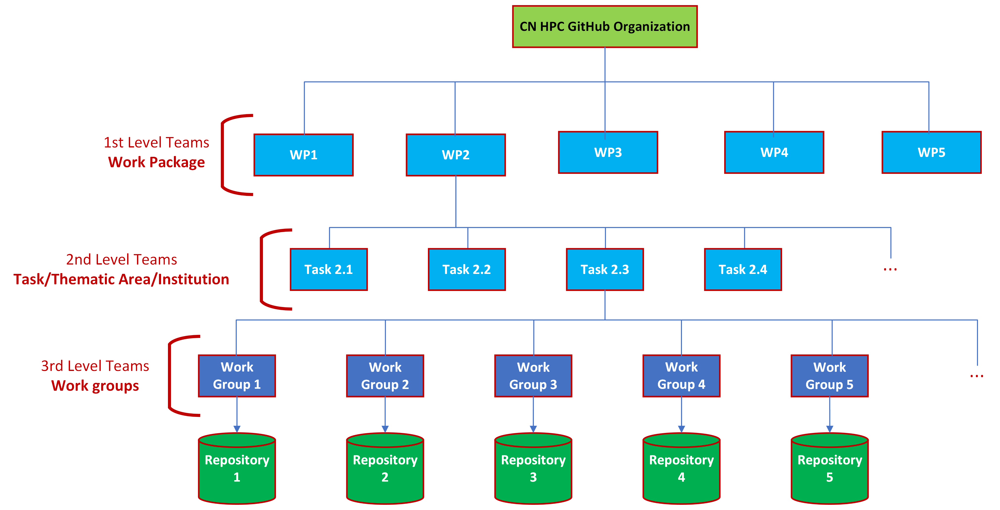

============
Introduction
============

Aim and General Principles
--------------------------

`Git <https://git-scm.com/>`_ is a free and open-source
distributed version control system, that tracks changes in files,
and is particularly useful when different people are working
on the same file at the same time.
`GitHub <https://github.com/>`_ is a web-based platform
which provides hosting for Git repositories,
extending the functionalities of Git with a web-based graphical interface
and many other features like issue tracking and pull requests.
It enables code sharing and collaborative work,
fostering the revision process, allowing the integration of
different development lines without impacting the
functionalities of the production code,
and providing instruments to solve conflicts.

The aim of having a common space to gather the code
produced within Spoke 4 - Earth & Climate of the
ICSC - Italian Research Center on High Performance Computing,
Big Data and Quantum Computing is to provide a centralized space
for tracking code development, facilitate the sharing and coordination of efforts,
and preserve the assets built during the project's development.

It is assumed that the project developers have at least a basic understanding
of version control principles and fundamental Git and GitHub operations.

Being a large and heterogeneous project, involving tasks organized
into 5 Work Packages, the creation of a single repository
with a tree structure to collect the produced code is deemed too rigid.
This approach would inhibit the necessary management flexibility,
interfering with the day-by-day work of the various developers, also adding
a significant workload to administrators in charge of managing such infrastructure.
Taking into account the nature of the project,
the creation of a
`GitHub Organization <https://docs.github.com/en/organizations/collaborating-with-groups-in-organizations/about-organizations>`_
is considered more appropriate.
A GitHub organization is a shared account, serving as a container
for multiple repositories, which can be given a unique name and brand.
Organizations enable to define a hierarchy of roles
for the personal accounts joining it,
allowing a subset of people to granularly manage
the access to the organization resources.
This solution allows individual working groups
to organize their repositories according to specific needs,
while leaving control of the overall structure and organization
roles to a restricted group of administrators.

.. fig_organization_structure:

   ICSC CN HPC Spoke 4 GitHub organization structure.

.. raw:: html
  

    A[ICSC CN HPC Spoke 4 Github Organization]

    subgraph **1st Level Teams**
    B1[WP1]
    X1:::hidden
    B2[WP2]
    X2:::hidden
    B3[WP3]
    B4[WP4]
    B5[WP5]
    X3:::hidden
    B6[Innovation Grants]
    end
    classDef hidden fill:none,stroke:none
 
    A --> B1
    A --- X1 --> B2
    A --- X2 --> B3
    A --> B4
    A --> B5
    A --- X3 --> B6
    
    subgraph **2nd Level Teams**
    C1[Institution 1]
    C2[Institution 2]
    C3[Task 3.1]
    X2_1:::hidden
    C4[Task 3.2]
    C5[Task 3.3]
    C6[Grant 1]
    C7[Grant 2]
    end

    B2 --- C1
    B2 --- C2
    B3 --- C3
    B3 --- X2_1 --- C4
    B3 --- C5
    B6 --- C6
    B6 --- C7

    subgraph **3rd Level Teams**
    D1[Work Group 1]
    D2[Work Group 2]
    D3[Work Group 3]
    D4[Work Group 4]
    D5[Work Group 5]
    end

    C4 --> D1
    C4 --> D2
    C4 --> D3
    C4 --> D4
    C4 --> D5

    E1[(Repository 1)]
    E2[(Repository 2)]
    E3[(Repository 3)]
    E4[(Repository 4)]
    E5[(Repository 5)]

    D1 --> E1
    D2 --> E2
    D3 --> E3
    D4 --> E4
    D5 --> E5
   
  

Organization Structure
----------------------

The structure of a GitHub organization revolves
around **Teams**.
Teams are groups of organization members that can be
effectively utilized to control member permissions.
It is possible to create nested teams to reflect
the actual structure of working groups.
More details about GitHub Teams can be found :ref:`here <Teams>`.

Considering the structure of the Spoke's working groups,
a hierarchy of teams corresponding to the project proposal has been deployed.
Figure :ref:`fig_organization_structure` illustrates such structure.
Five primary teams (**Work Packages Teams**) have been created, corresponding to
the five work packages of Spoke 4.
These teams are designed to bring together all the individuals
involved in or collaborating on the activities within
each work packages.
For each WP team, two member are required to be team maintainers
(more on this :ref:`here <par_team_maintainers>`).
Maintainers will be able to manage team memberships and settings.
This approach ensures the necessary autonomy for individual work packages,
providing the organization with the required operational flexibility.

The fine structure can be discussed and adapted based on
the needs of individual work packages.
The ability to create child teams will be disabled for the ICSC Spoke 4
GitHub organization members.

Roles
-----

Within a GitHub Organization, it is possible to define **Roles**.
Roles are a set of permissions that can be assigned to individuals or teams.
A permission is the ability to perform an action on GitHub.
There are three types of roles:

#. **Organization-level:** management of the entire organization and its settings, teams, and repositories.
#. **Team-level:** team management.
#. **Repository-level:** creation and access to repositories.

Organization-level roles are meant to control members' access
to the organization and its resources.
Two organization roles are relevant to the ICSC Spoke 4 GitHub Organization:

* **Organization Member**: default, non-administrative role.
* **Organization Owner**: complete administrative access.

The owners of the ICSC Spoke 4 GitHub Organization are appointed
by the coordination of the Spoke.
About 3-4 members are selected for this role,
to ensure the necessary stability and continuity in the management
and long-term maintenance of the organization and the connected repositories.
Organization owners can create repositories, configure their settings,
delete them, and perform other relevant operations.
To protect the organization's data, **the creation of repositories
has been restricted to only the organization owners.**
Work package leaders or work package team maintainers are required to provide a list
of the repositories they intend to create or transfer to the organization.
Later requests will follow a similar protocol.
More on this in the :ref:`WP Team Maintainer's How-to`.

Team-level roles allow members to manage a team.
Any organization member can be assigned the role of team maintainer,
granting them administrative permissions over the team.
For more information check out :ref:`here <par_team_maintainers>`.

The access to each repository can be defined by
`repository-level roles <https://docs.github.com/en/organizations/managing-user-access-to-your-organizations-repositories/managing-repository-roles/repository-roles-for-an-organization>`_.
The following table provides a summary of the different possibility:

+----------+---------------------------------------------------------------------------------------------------+
| Role     | Description                                                                                       |
+==========+===================================================================================================+
| Read     | View the repo (for non-code contributors)                                                         |
+----------+---------------------------------------------------------------------------------------------------+
| Triage   | NO write access. Manage issues, discussions, and pull requests                                    |
+----------+---------------------------------------------------------------------------------------------------+
| Write    | Push to the repo (for active contributors)                                                        |                        
+----------+---------------------------------------------------------------------------------------------------+
| Maintain | Manage the repository without access to sensitive or destructive actions (for project managers)   |
+----------+---------------------------------------------------------------------------------------------------+
| Admin    | Full access to the repo, including sensitive and destructive actions (security settings/deletion) |
+----------+---------------------------------------------------------------------------------------------------+

General Policies
----------------

* Throughout the project, the repositories can be kept private.
  Therefore, it will be accessible only to the the development team
  and accessible by the related 2nd level team.
* At the end of the project the repository will be made public.
  The scientific coordination of the project or the WP maintainers
  can decide to make public part of the repository during the project lifetime.
* The purpose of each repo is to contain and track the development of a defined,
  independent set of programs designed to perform a specific task.
  Considering the diverse needs of the developers involved in the Spoke,
  a common layout is not strictly required.
  Nevertheless, GitHub
  `best practices <https://docs.github.com/en/repositories/creating-and-managing-repositories/best-practices-for-repositories>`_
  are recommended, particularly the creation of a README file
  specifying the purpose of the code contained in each repository.

