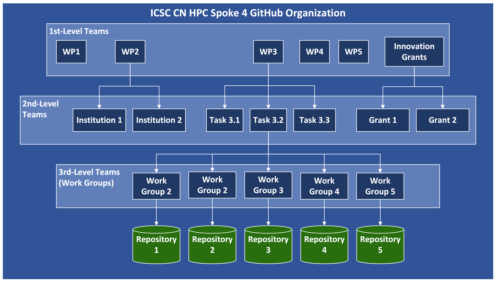

============================
Work Package Leader's How-to
============================

This guide is intended for the Project 
Work Package (WP) Leaders
who wish to set up an infrastructure
within the ICSC CN HPC Spoke 4 
GitHub Organization to host
the code produced during the activities
they oversee.
Leaders of Innovation Grants should
also follow these guidelines when 
requesting access to the Organization.

---------------
Teams Hierarchy
---------------

.. note::
   Check out :ref:`Teams` for a brief description of what a team is
   and what the role of a team maintainer is.

Within the ICSC CN HPC Spoke 4 GitHub organization, 
the teams hierarchy is organized to mirror 
the structure outlined in the project proposal.
For safety and organizational reasons, 
the authority to create teams
is reserved for the Organization owners.

A three-level hierarchy has been implemented,
as described below:

#. **Level 1: Work Packages/Innovations Grants**
   Each of the Work Package team brings 
   together developers working 
   within the same WP.
   The *Innovation Grants* team groups
   all Organization members
   involved in one of these grants. 
   Each WP team is assigned two maintainers,
   appointed by the WP leader.
   No maintainers are assigned 
   to the *Innovation Grants* team.
#. **Level 2: Task/Thematic Area/Institution**
   The second level of the hierarchy
   is designed to adapt to the needs
   of the research groups involved 
   in the project.
   To encourage the sharing of code assets 
   produced, it is recommended to create 
   teams that reflect the project tasks.
   However, teams can also be organized 
   by grouping members affiliated
   with the same institution,
   or those working on similar
   thematic or disciplinary areas.
   The decision on how to organize 
   second-level teams is delegated to the
   work packages and innovation grants leaders.
   When requesting access to the Organization,
   WP/innovation grant leaders must 
   communicate the desired second-level 
   structure to the organization owners.
   Additionally, they should specify two 
   Organization member for each second level 
   team who will become team maintainers
   (for teams related to the project
   work packages, these member may,
   but are not required to, be the same 
   as the WP team maintainers).
   As the ability to create child teams
   is disabled for Organizazion members,
   Organization owners
   will be responsible for implementing
   the desired second-level structure.
    
#. **Level 3: Work Groups.**
   These teams are meant to group developers working on a single repository.
   They can consist of a single person, up to an arbitrary number of people.
   At least one organization member is required to be maintainer
   of each of these teams.
   Ideally, the maintainer should be the main developer of the code
   within the repository
   (akin to the owner of a personally held GitHub repository).

.. _fig_organization_structure:

   ICSC CN HPC Spoke 4 GitHub Organization structure

Memberships, Teams & Repositories Management
--------------------------------------------

For safety and organizational reasons,
the ability to create repositories within the
Organization is reserved for owners only.

If one or more individual/work group within the WP
wish to utilize the ICSC Spoke 4 GitHub organization,
the WP leader must contact the Organization owners, providing:

#. The GitHub usernames of the two maintainers for the WP team,
   the structure and GitHub usernames of maintainers for the 2nd level teams.
   The following table can be used as a guide:
      
   +-----------------------+--------------+--------------+
   | Token name            | Maintainer 1 | Maintainer 2 |
   |                       |              |              |
   +=======================+==============+==============+
   | WP team               |              |              |
   +-----------------------+--------------+--------------+
   |                       |              |              |
   +-----------------------+--------------+--------------+
   | 2nd level team XXXX 1 |              |              |
   +-----------------------+--------------+--------------+
   | 2nd level team XXXX 2 |              |              |
   +-----------------------+--------------+--------------+
   | ...                   |              |              |
   +-----------------------+--------------+--------------+

#. The list of developers who are willing to become member of the organization,
   specifying name, family name, affiliation,
   GitHub username and a contact email address.
#. The list of repositories to be created, providing the repositoy name,
   the associated project task,
   and the GitHub username of the person responsible for the repository.

For convenience, points 2 and 3 can be done using a spreadsheet
provided by the organization's owners, which contains the following fields:

+-------+------+-------------+----------+---------+------+------------+------------+
| First | Last | Affiliation | GitHub   | Contact | Task | Repository | Repository |
| Name  | Name |             | Username | Email   |      | Name       | Manager    |
+=======+======+=============+==========+=========+======+============+============+
|       |      |             |          |         |      |            |            |
+-------+------+-------------+----------+---------+------+------------+------------+
|       |      |             |          |         |      |            |            |
+-------+------+-------------+----------+---------+------+------------+------------+
|       |      |             |          |         |      |            |            |
+-------+------+-------------+----------+---------+------+------------+------------+

.. warning::

   Each developer must already possess their own personal GitHub account.

The Organization owners will send invitations to the interested developers,
who will have 7 days to accept the invitation, after which it will expire.
In the invitation phase, each prospective member is assigned to their
respective WP and to a series of lower-level teams.
Additionally, they will be given access to a series of repositories.

Specifically, each member is included as:

#.  Maintainers of 3rd level teams corresponding to
    the repositories they are responsible for.
#.  Members of 3rd level teams corresponding to
    repositories they can access and participate in the development
    (but they are NOT responsible for).
#.  Members of the 2nd level related to activities/tasks they are involved in.
#.  Member of their WP team.

Being a member of each of these teams ensures
the user a set of permissions on individual repositories.
This is because access to individual repositories
is not granted to individual user accounts
but to Organization teams, following the policy below:

*  3rd level teams: write permissions on the corresponding repository.
   This enables the actual working group to autonomously manage
   the contents of the respective repository.
*  2nd level teams: read permission for all the related repositories.
   This promotes and strengthens collaboration between the project's
   groups focusing on similar topics.

Please note that 3rd level teams and repositories have a one-to-one correspondence
and share the same name.
The users responsible for a repository are maintainers
of the corresponding 3rd level teams.
This role grants them the authority to add and remove
other members of the Organization to/from the teams.
In this way, they can control the group of collaboratorswho can actively
contribute to the development of the code within the repository,
provided that these collaborators are members of the Organization.

Once developers have joined the Organization, WP team and 2nd level teams
maintainers can include/remove them in/from the teams they are in charge of.
It's important to note that being a member of a child team does
not automatically confer membership in the parent team.
Therefore, each member should be added independently to each team at every level.

Individual developers can submit requests to join the Organization
and create repositories at a later time by directly contacting
the Organization's owners (with the WP leader cc'd)
and completing the spreadsheet.

