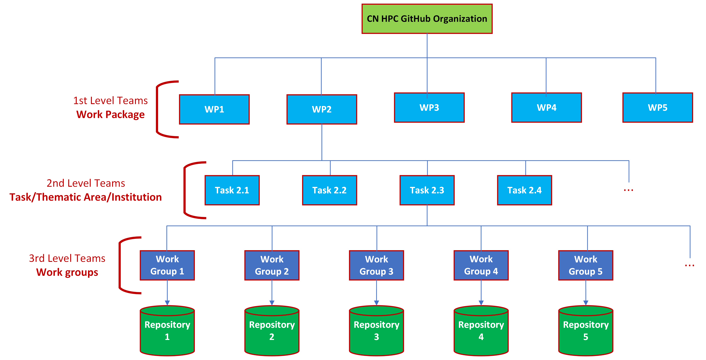

===============
Member's How-to
===============

-----------
First steps
-----------

After receiving and accepting the invitation to join the Organization,
members can access the Organization's web pages.
The main page of the Organization can be reached by using the link
in the left sidebar of each member's GitHub main page, under the section 'Organizations'.
In the invitation phase, each prospective member is assigned to their
respective WP and to a series of lower-level teams.
Additionally, they will be given access to a series of repositories.
Specifically, each member is included as:

#.  Maintainers of 3rd level teams corresponding to
    the repositories they are responsible for.
#.  Members of 3rd level teams corresponding to
    repositories they can access and participate in the development
    (but they are NOT responsible for).
#.  Members of the 2nd level related to activities/tasks they are involved in.
#.  Member of their WP team.

Being a member of each of these teams ensures the user a set of permissions on individual repositories.
This is because access to individual repositories is not granted to individual user accounts
but to Organization teams, following the policy below:

*  3rd level teams: write permissions on the corresponding repository.
   This enables the actual working group to autonomously manage the contents of the respective repository.
*  2nd level teams: read permission for all the related repositories.
   This promotes and strengthens collaboration between the project’s groups focusing on similar topics.

Please note that 3rd level teams and repositories have a one-to-one correspondence
and share the same name.
The users responsible for a repository are maintainers of the corresponding 3rd level teams.
This role grants them the authority to add and remove other members of the Organization to/from the teams.
In this way, they can control the group of collaborators who can actively contribute
to the development of the code within the repository, provided that these collaborators are members of the Organization.

   ICSC CN HPC Spoke 4 GitHub organization structure.

